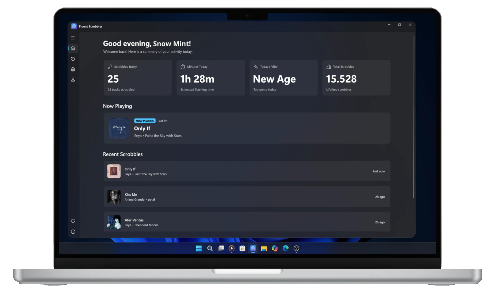

  

<h1 align="center">Fluent Scrobbler</h1>

  
  
  
  

  <strong>A Lightweight, and Modern Scrobbler for Windows 11</strong>

  <a href="https://snw-mint.github.io/fluent-scrobbler/">Overview</a> •
  <a href="https://github.com/snw-mint/fluent-scrobbler/releases">Installation</a> •
  <a href="https://snw-mint.github.io/fluent-scrobbler/privacy.html">Privacy</a> •
  <a href="https://snw-mint.github.io/fluent-scrobbler/terms.html">Terms</a>

  

---

## Features

- **Automatic System Media Scrobbling**: Captures currently playing tracks across desktop apps and browsers using Windows System Media Transport Controls.
- **Last.fm Integration**: Seamless authentication, real-time scrobbling, and "Now Playing" status updates.
- **Scrobble History**: View your recent scrobbles and track status directly inside the application.
- **Native Fluent Design**: Built with WinUI 3 for a modern Windows 11 design aesthetic with dark and light mode support.
- **Background Execution & Startup**: Runs quietly in the system background with optional auto-start on Windows startup.

## Installation & Setup

1. **Download**: Visit the [Releases](https://github.com/snw-mint/fluent-scrobbler/releases) page and download the setup installer (`FluentScrobbler-Setup.exe`).
2. **Install**: Run the installer and follow the on-screen instructions.
3. **Connect Account**: Open Fluent Scrobbler, navigate to the **Account** section, and click **Connect to Last.fm** to authorize the application.
4. **Start Scrobbling**: Play music in any Windows media player or web browser, and your listening history will scrobble automatically.

> [!NOTE]
> **VLC Media Player**: VLC does not support Windows Media Transport Controls (SMTC) by default. To enable scrobbling from VLC, install the [vlc-win10smtc plugin](https://github.com/spmn/vlc-win10smtc/releases).

## System Specifications & Tech Stack

### System Requirements

- **Operating System**: Windows 10 (version 1809 / build 17763 or higher) or Windows 11
- **Architecture**: x64

### Technical Specifications

- **Language**: C# (.NET 8.0)
- **UI Framework**: WinUI 3 / Windows App SDK 1.5+
- **Media API**: Windows.Media.Control (GlobalSystemMediaTransportControlsSessionManager)

## Privacy

I value your privacy. Please read the [Privacy Policy](https://snw-mint.github.io/fluent-scrobbler/privacy.html) to more information.

## Feedback & Bug Reports

Because this project is in Beta, user feedback is very valuable to me:

- To report a bug or request a new feature, please open an issue on [GitHub Issues](https://github.com/snw-mint/fluent-scrobbler/issues).
- For security concerns, please refer to my [Security Policy](SECURITY.md).

## License & Legal Notice

This project is licensed under the **GNU General Public License v3.0** - see the [LICENSE](LICENSE) file for details.

### Legal Disclaimer

Fluent Scrobbler is an independent open-source application developed by me. It is not affiliated with, endorsed by, or sponsored by Last.fm, CBS Interactive. All trademarks and brand names belong to their respective owners.

---

by [Snow Mint](https://github.com/snw-mint/fluent-scrobbler)
